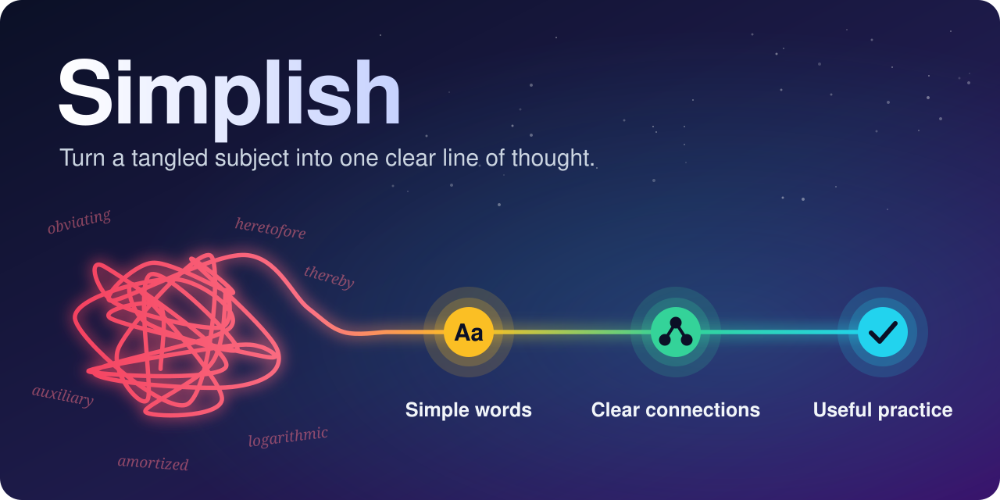

# Simplish



**Simple words. Clear connections. Useful practice.**

Simplish is a reusable AI skill for explaining unfamiliar or complex subjects. It helps the reader find the main idea, follow the reasoning, and practise when learning is the goal.

It combines plain-language principles inspired by ASD-STE100, response organization inspired by i-have-adhd, and research on learning. It preserves the requested depth and technical meaning. The combined skill has not been experimentally validated for attention or learning gains.

**Jump to:** [See it in action](#see-it-in-action) · [Use it](#use-it) · [Install](#install-or-refresh-the-skill) · [Improve it](#improve-it)

## See it in action

The same question, answered two ways.

**Prompt:** *How does a database index work? I know basic SQL.*

<table>
<tr>
<th width="50%">A typical dense answer</th>
<th width="50%">With Simplish</th>
</tr>
<tr>
<td valign="top">

A database index is an auxiliary data structure, typically a B-tree, that provides logarithmic-time lookups by maintaining sorted key-pointer pairs, thereby obviating full table scans at the cost of write amplification and additional storage overhead.

</td>
<td valign="top">

An index lets the database find rows without reading the whole table.

Without an index, `WHERE email = 'ana@example.com'` makes the database check every row. This is a *full table scan*.

An index on `email` is a separate, sorted copy of the email values. Each value points to its row. Because the copy is sorted, the database can narrow the search in a few steps, as you do with a word in a dictionary.

The comparison has one limit: a dictionary is printed once, but an index must change each time the data changes. Therefore, every write to that column becomes slower, and the index uses disk space.

Index the columns that you search or join on often, not every column.

</td>
</tr>
</table>

Both answers are correct. The second one puts the main idea first, defines the one term the reader needs, connects each step with "because" and "therefore," and keeps the cost beside the benefit.

The responses in this section are illustrative. They were written to follow the rules in [SKILL.md](SKILL.md), and real output differs between models. Examples 1 to 4 use prompts from the [evaluation cases](evals/cases.md), so you can run them and compare.

### 1. A quick question gets a quick answer

> **Prompt:** Why does a metal spoon feel colder than a wooden spoon when both have been in the same room all night? Answer in no more than four sentences.

> Both spoons are at the same temperature: room temperature. Your hand is warmer than the room, so heat flows from your hand into either spoon. Metal conducts heat much faster than wood, so the metal spoon removes heat from your skin more quickly. Your skin senses that faster heat loss as "cold."

Four sentences, as requested. No lesson, no quiz, no closing offer.

### 2. A rewrite keeps every condition

> **Prompt:** Rewrite this fictional policy in simple English. Preserve every condition and deadline; do not add advice or change the policy.

**Original**

> Project owners must submit the release checklist at least two business days before deployment. Security approval is required only when a release changes authentication or handles a new category of personal data. If that approval is required but has not been granted, deployment must be postponed. Emergency fixes may bypass the checklist deadline with the incident commander's written approval, but this exception does not waive required security approval. A retrospective checklist must be submitted within one business day after an emergency deployment.

**With Simplish**

> **Standard releases**
>
> 1. Project owners must submit the release checklist at least two business days before deployment.
> 2. Security approval is required only if the release does one of these things:
>    - It changes authentication.
>    - It handles a new category of personal data.
> 3. If security approval is required and has not been granted, the deployment must be postponed.
>
> **Emergency fixes**
>
> 1. An emergency fix can skip the checklist deadline if the incident commander approves in writing.
> 2. This exception applies only to the checklist deadline. Required security approval is still required.
> 3. A retrospective checklist must be submitted within one business day after the emergency deployment.

Both deadlines, both security triggers, the named approver, and the limit of the exception are all still there. Simplish rewrites the text; it does not summarize the text.

### 3. A lesson explains why, then offers practice

> **Prompt:** I understand what one half and one third mean, but I do not understand why I cannot add their numerators and denominators. Teach me how to add 1/2 and 1/3. Explain why each important step works, then give me one optional practice problem with its answer after the question.

<details>
<summary><b>Show the response</b></summary>

> You can only count pieces together when the pieces are the same size. A half and a third are different sizes, so the first step is to cut both into equal pieces.
>
> **Step 1: Find a piece size that fits both.**
> Sixths work, because 6 is a multiple of both 2 and 3.
>
> **Step 2: Rewrite each fraction in sixths.**
> - 1/2 = 3/6. One half of a pizza is the same amount as three of its six slices.
> - 1/3 = 2/6. One third is the same amount as two of the six slices.
>
> The amounts did not change. Only the size of the pieces changed.
>
> **Step 3: Count the pieces.**
> 3 sixths + 2 sixths = 5 sixths, so 1/2 + 1/3 = **5/6**.
>
> The denominator stays 6 because the denominator names the piece size, and the piece size did not change when you counted.
>
> **Why adding the tops and the bottoms does not work**
> That method gives 2/5. But 2/5 is less than 1/2, and you started with 1/2 and added more. The result must be greater than 1/2, so 2/5 cannot be correct. The method fails because it counts a half-piece and a third-piece as if they were the same size.
>
> **Optional practice**
> Add 1/4 + 1/3. Try it before you open the answer.
>
> <details>
> <summary>Answer</summary>
>
> Twelfths fit both, because 12 is a multiple of 4 and 3.
> 1/4 = 3/12 and 1/3 = 4/12.
> 3/12 + 4/12 = **7/12**.
>
> </details>

</details>

The lesson starts from what the learner already knows, gives a reason for each step, and treats the wrong method as a reasonable idea to test. The practice answer stays hidden until the learner has tried.

### 4. An experienced reader gets only the new part

> **Prompt:** I know how to calculate the mean and median. Explain why a large outlier can change the mean a lot while leaving the median unchanged. Use one small numerical example. Skip definitions I already know and do not add a quiz.

> The mean uses the size of every value. The median uses only which value is in the middle position after sorting.
>
> Take 2, 4, 6, 8, 10. The mean is 6 and the median is 6.
>
> Now replace 10 with 100: 2, 4, 6, 8, 100.
>
> - The sum goes from 30 to 120, so the mean goes from 6 to **24**.
> - The middle value is still the third one, so the median is still **6**.
>
> The outlier changed how large the last value is, and the mean includes that size. The outlier did not change which value is in the middle, and that position is all the median uses.
>
> The median *can* stay unchanged, but it does not always. If you add 100 as a sixth value instead of replacing one, the middle moves between 6 and 8, and the median becomes 7.

No definitions, no quiz, and the qualification ("can," not "always") is kept.

### What stays the same in every answer

| Simplish does | Simplish does not |
|---|---|
| Put the answer or the main idea first | Open with praise or an announcement of what comes next |
| Keep technical terms and define them at first use | Replace exact terms with vague ones |
| Keep conditions, exceptions, and uncertainty | Cut content to make the answer look shorter |
| Give the full detail in one response when you ask for depth | Make you ask to "continue" for the rest |
| Add practice when you want to learn | Add a quiz or homework to a plain answer |
| State what the evidence supports | Promise attention or memory gains |

## Use it

Load [SKILL.md](SKILL.md) as instructions in your preferred assistant, then ask it to use Simplish:

```text
Use Simplish to explain how a database index works. I know basic SQL.

Use Simplish to rewrite this document in simple English. Keep every condition.

Use Simplish to teach me how fractions work with an example and optional practice.

Use Simplish: Why must a career evolve with age? Is there one age when people peak?
Give a detailed answer and distinguish evidence from general advice.
```

| Your request | How Simplish responds |
|---|---|
| Quick question | Direct answer with necessary qualifications |
| Rewrite | Clearer language that preserves the original meaning |
| Explanation | Main idea, connected reasoning, and useful examples |
| Lesson | Prerequisites, worked examples, and optional practice |
| Study plan | Practice, feedback, and later review adapted to the goal |

Simplish does not force every answer into a template. Long answers stay complete. Necessary technical terms stay in the explanation and are defined where needed.

## Install or refresh the skill

The same `SKILL.md` and `references/` files use the shared skill format supported by both tools. No separate version of the instructions is needed.

| Tool | Personal skill folder | Explicit invocation |
|---|---|---|
| Codex | `~/.agents/skills/simplish/` | `$simplish` in the CLI or IDE; select the skill in the app |
| Claude Code | `~/.claude/skills/simplish/` | `/simplish` |

The locations and invocation methods follow the [Codex skill documentation](https://learn.chatgpt.com/docs/build-skills) and [Claude Code skill documentation](https://code.claude.com/docs/en/skills). Local installation applies to the local tools; it does not upload a skill to a cloud account.

To install for both tools on macOS or Linux, run this from the repository root:

```sh
for simplish_dir in "$HOME/.agents/skills/simplish" "$HOME/.claude/skills/simplish"; do
  mkdir -p "$simplish_dir/references"
  cp SKILL.md "$simplish_dir/SKILL.md"
  cp references/learning-and-memory.md "$simplish_dir/references/learning-and-memory.md"
done
```

These commands replace the two installed files. Save separate local edits first. If Simplish is already installed in another configured skills directory, refresh that copy instead of creating a duplicate. Keep this repository as the source for future changes.

The installed package is:

```text
simplish/
├── SKILL.md
└── references/
    └── learning-and-memory.md
```

For an assistant without a skill loader, supply the instructions from `SKILL.md` and include the learning reference when asking for a lesson or study plan. Package compatibility does not guarantee identical answers across models; use the evaluation cases to review behavior in each tool.

## Improve it

Start with a response that is hard to read, loses meaning, or fails to teach the requested idea. Make a focused change, then check the result with representative prompts.

Validation requires Python 3.9 or later. The skill itself is Markdown and needs no Python dependencies.

```sh
python3 -m venv .venv
. .venv/bin/activate
python3 -m pip install -r requirements-dev.txt
python3 scripts/validate.py
```

The validator checks skill metadata, required files, and local Markdown file links. It does not judge factual accuracy, reading quality, or learning outcomes. Use the [evaluation cases](evals/cases.md) for response review and the [contribution guide](CONTRIBUTING.md) for the full workflow.

## Repository guide

| File | Purpose |
|---|---|
| [SKILL.md](SKILL.md) | Main instructions loaded by the assistant |
| [Learning and memory](references/learning-and-memory.md) | Teaching guidance, sources, and evidence limits |
| [Evaluation cases](evals/cases.md) | Six realistic prompts and a review rubric |
| [CONTRIBUTING.md](CONTRIBUTING.md) | How to propose and evaluate improvements |
| [CHANGELOG.md](CHANGELOG.md) | History of meaningful changes |

## Sources and scope

- [ASD-STE100](https://www.asd-ste100.org/STE_faq.html) informs the use of clear wording and consistent terms. Simplish does not certify formal ASD-STE100 conformity.
- [i-have-adhd](https://github.com/ayghri/i-have-adhd) informs response organization. Simplish does not assume a diagnosis or a fixed attention span.
- The [learning reference](references/learning-and-memory.md) links the research behind retrieval practice, feedback, worked examples, and spaced review, with limits for each source.

Clarity can support understanding. Lasting learning also depends on prior knowledge, practice, feedback, and later use.
